# Client St0r

[](https://github.com/agit8or1/clientst0r/stargazers)
[](https://github.com/agit8or1/clientst0r/releases)
[](https://github.com/agit8or1/clientst0r)
[](LICENSE)
[](https://www.djangoproject.com/)
[](https://www.python.org/)
[](https://snyk.io/test/github/agit8or1/clientst0r)
[](https://github.com/agit8or1/clientst0r)

> **Open-source, self-hosted MSP documentation platform — an alternative to IT Glue and Hudu.**
> Full data ownership. No SaaS fees. Runs on your infrastructure.

If Client St0r saves you time or money, a ⭐ star helps others find it.

| [IT Glue Alternative →](docs/it-glue-alternative.md) | [Hudu Alternative →](docs/hudu-alternative.md) | [What is ClientSt0r? →](docs/what-is-clientst0r.md) |
|---|---|---|

A complete, self-hosted IT documentation platform designed for Managed Service Providers (MSPs) and IT departments. Built with Django 6, Client St0r provides secure asset management, encrypted password vault, knowledge base, PSA integrations, and comprehensive monitoring tools.

Client St0r is commonly evaluated as an **open-source IT Glue alternative** and a **self-hosted Hudu alternative** for MSP documentation.

## 📸 Screenshots

*All screenshots include demo data and are watermarked. Random background feature enabled. [View full gallery →](docs/screenshots/)*

<table>
<tr>
<td width="50%">

### 🏠 Dashboard & Quick Access


</td>
<td width="50%">

### 📦 Asset Management


</td>
</tr>
<tr>
<td width="50%">

### 🔐 Password Vault & Security


</td>
<td width="50%">

### 📚 Documentation & Knowledge Base


</td>
</tr>
<tr>
<td width="50%">

### 🔒 Security Dashboard


</td>
<td width="50%">

### 🌐 Monitoring


</td>
</tr>
<tr>
<td width="50%">

### ⚙️ System Management


</td>
<td width="50%">

### 🏢 Multi-Organization & Access


</td>
</tr>
<tr>
<td width="50%">

### 🚗 Service Vehicles & Fleet Inventory


</td>
<td width="50%">

### 📦 Inventory QR Codes


</td>
</tr>
<tr>
<td width="50%">

### 🧾 Vehicle Receipt Scanning (AI OCR)
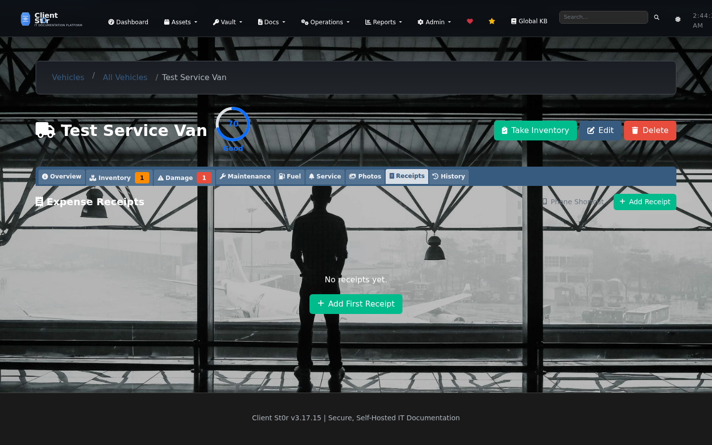
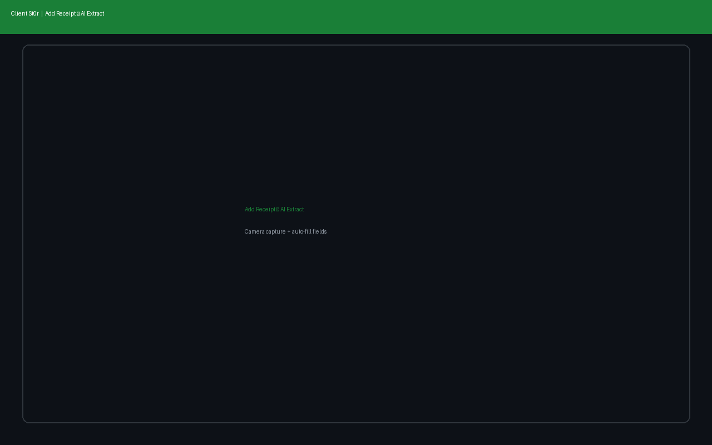

</td>
<td width="50%">

### 📱 Install App / Phone Shortcut
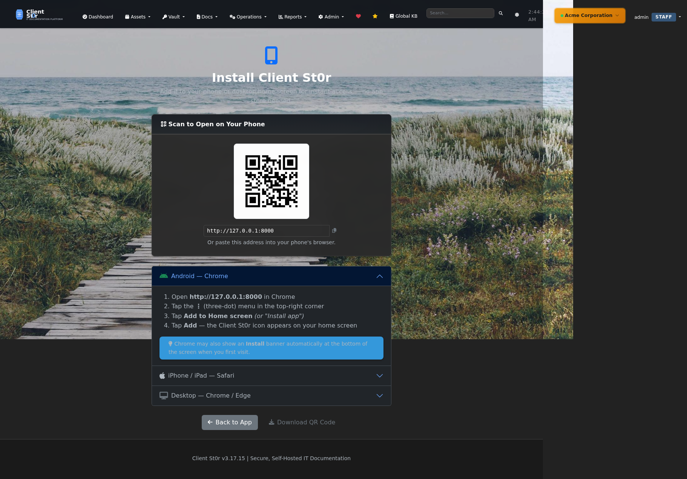
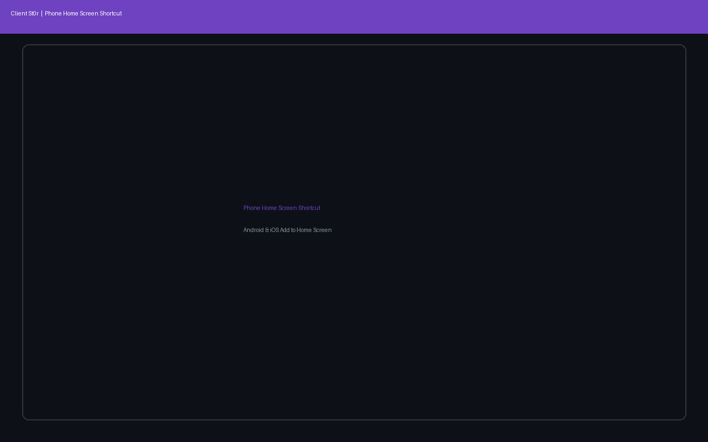

### 🎫 Native PSA / Service Desk *(v3.17 — 12+ phases)*
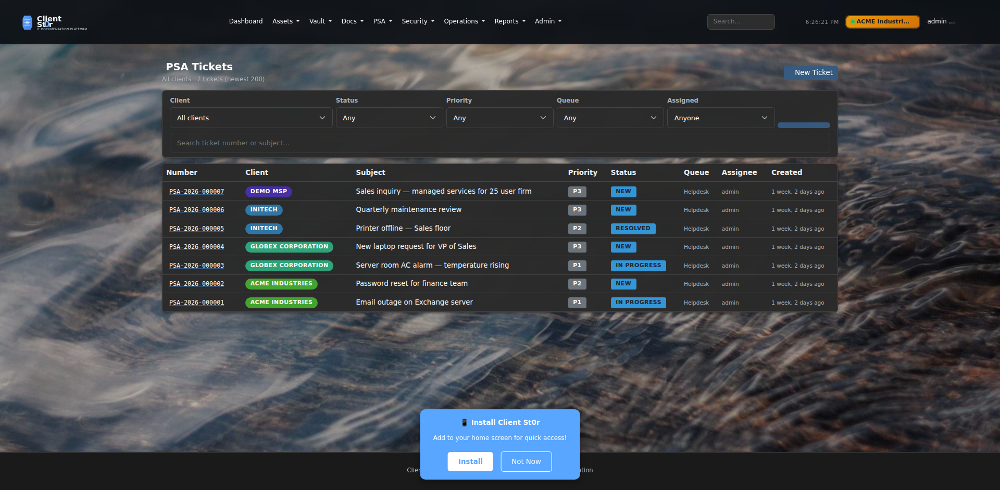
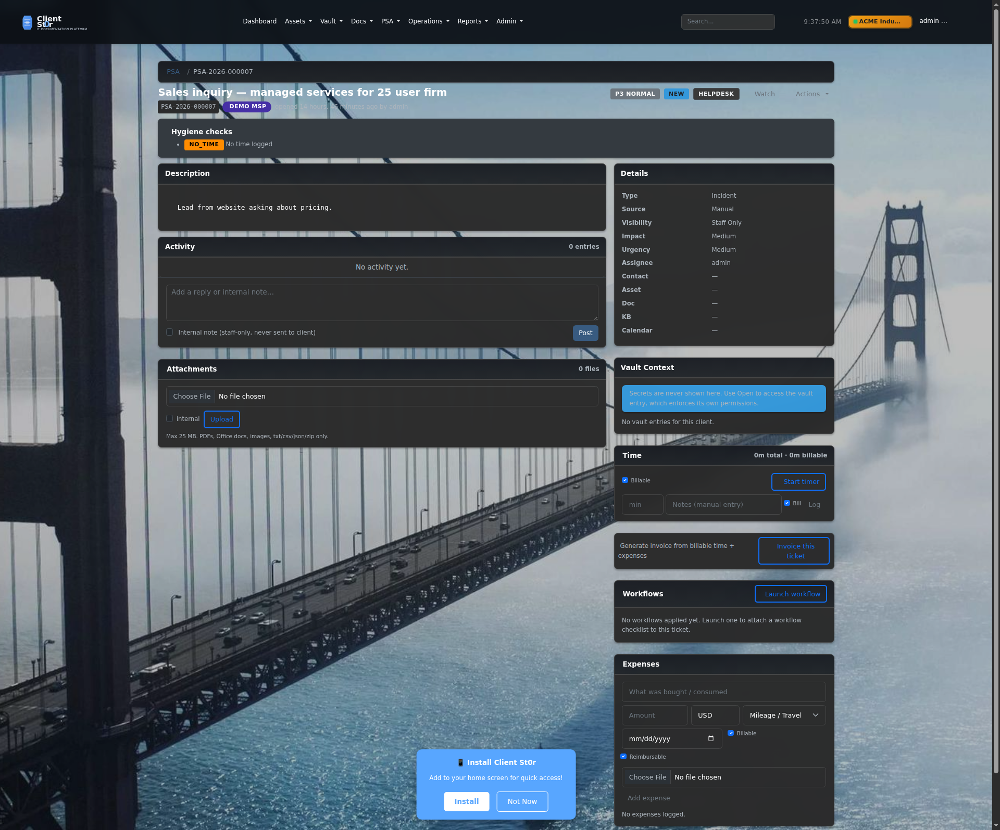
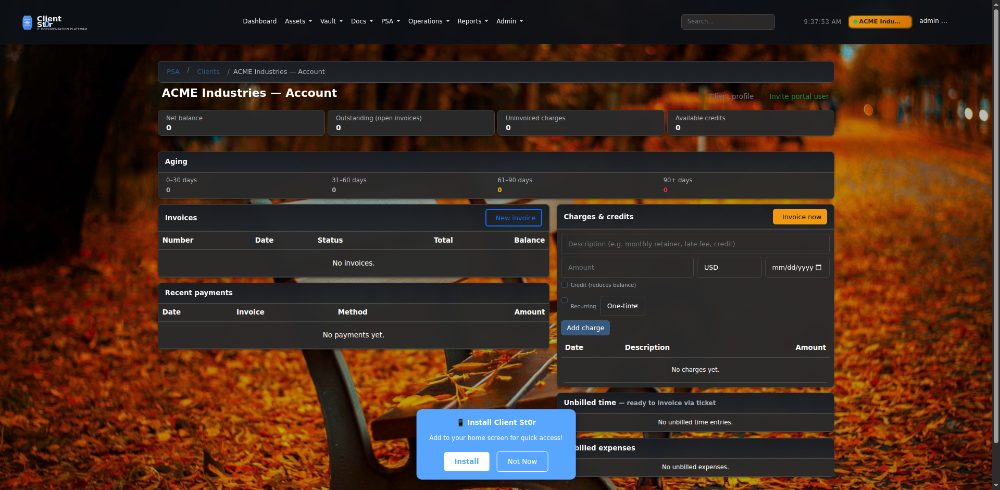
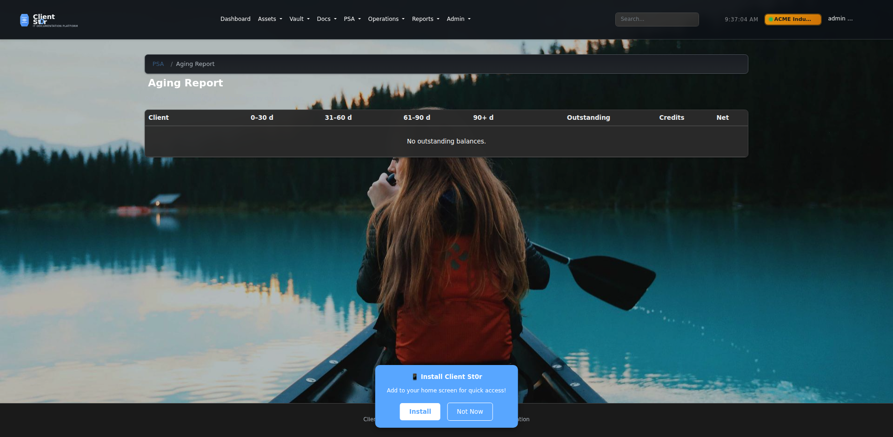


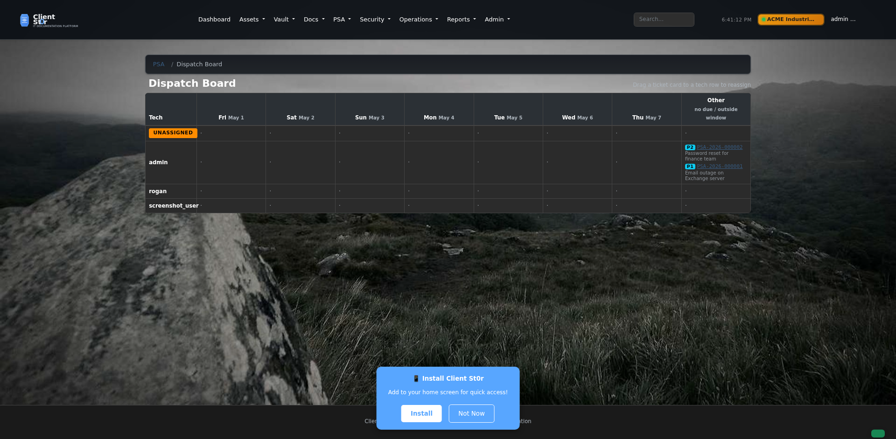
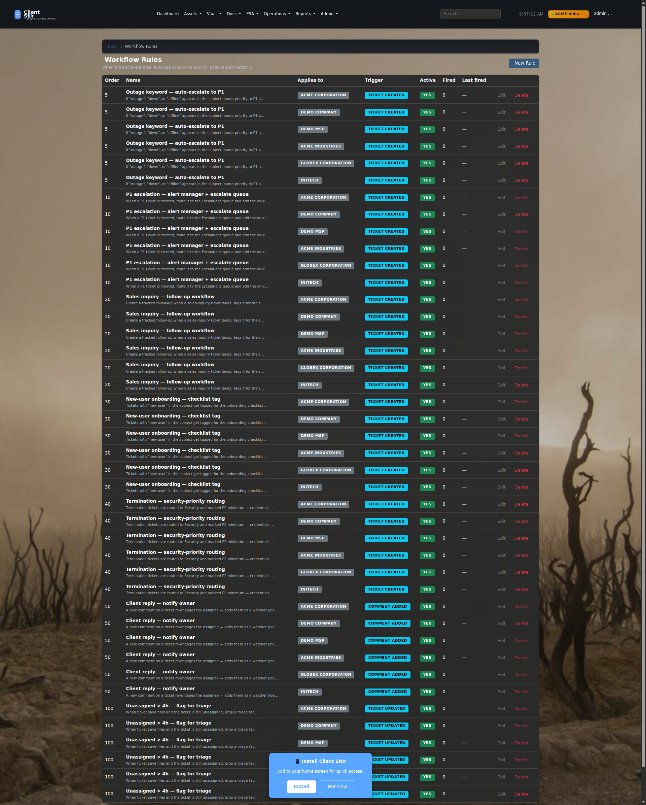


### 🛡️ Security Alert Ingestion *(Phase 9 — v3.17.168, forms polished v3.17.182)*

Unified triage queue for EDR / AV / firewall alerts from any vendor, plus auto-ticket rules that fire on matching inbound alerts.

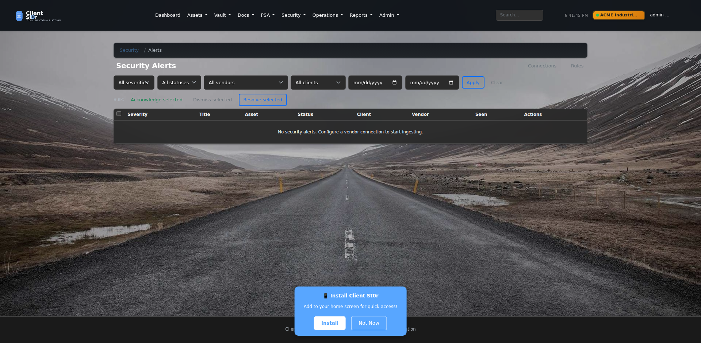
*Triage queue with severity / vendor / status filter chips. Bulk acknowledge, dismiss, and convert-to-ticket actions.*

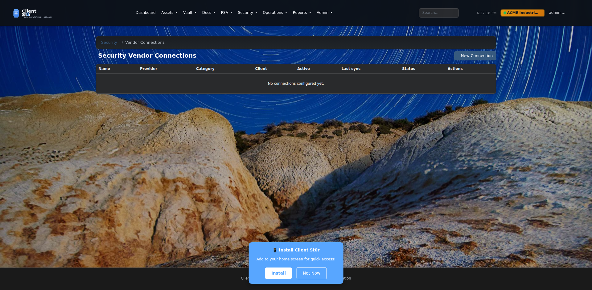
*All connected providers with status pill, last-sync, and per-row Test / Sync / Edit actions.*

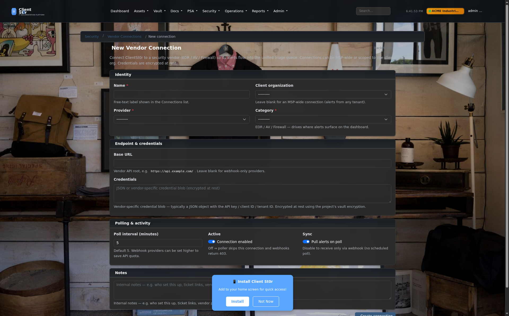
*Card-based form with sectioned layout (Identity, Endpoint & credentials, Polling & activity, Notes). Webhook URL + HMAC secret with one-click copy buttons appear when editing an existing connection.*

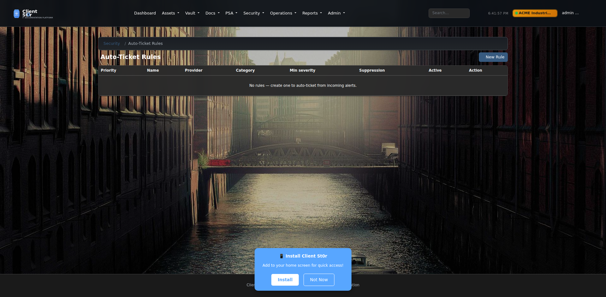
*Rules list ordered by priority — lower numbers fire first.*

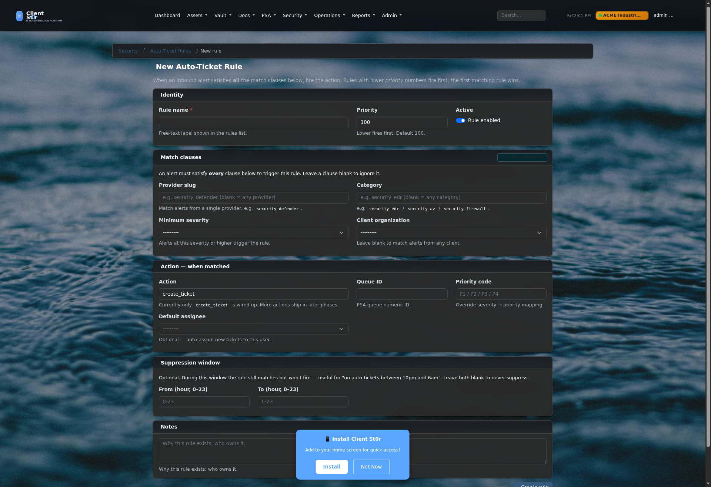
*Match clauses, action, and suppression window grouped into clearly-labeled sections. The "ALL must match" badge on Match clauses makes the AND-semantics obvious.*

### 🔌 Integration Connection Forms *(polished v3.17.183)*

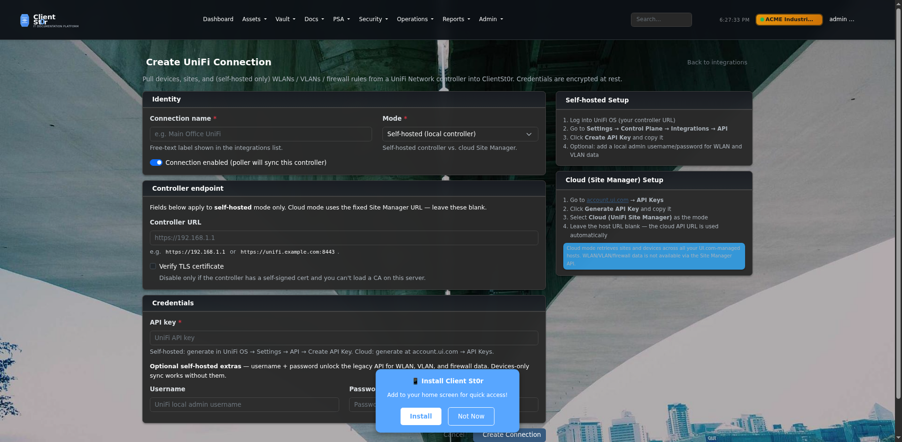
*Self-hosted vs. cloud Site Manager mode toggle; self-hosted-only fields hide automatically when Cloud is selected. Setup-guide sidebar shows the API key procedure for both flavors.*

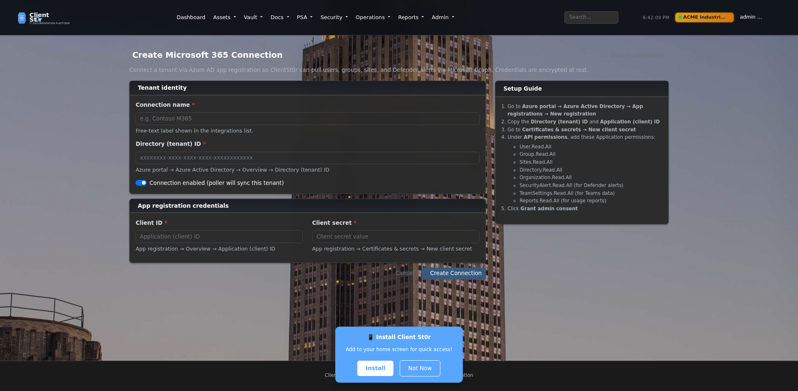
*Tenant ID + Azure app-registration credentials. Setup-guide sidebar lists the exact Graph API permissions required.*

### 🗺️ Live Roadmap *(rendered from `docs/ROADMAP.md`)*


*The roadmap is published in four places: the in-app `/core/roadmap/` page (shown), the About-page card, the GitHub markdown file at `docs/ROADMAP.md`, and a polling-friendly JSON feed at `/core/roadmap.json` for status pages and external dashboards.*

A complete in-house ticketing system:

**Ticketing & service desk**
- Tickets, queues, statuses, priorities, ticket types
- SLA engine with per-contract overrides + pause logic
- Time tracking (timer + manual entries; auto-tracked contract hours)
- Service catalog with structured-field templates
- Watchers, canned replies, @mentions, similar-tickets detection, merge
- Workflow runbooks **embedded directly on tickets** with inline checklist + sign-off audit history
- Vault context surfaced inline on every ticket

**Projects, contracts & schedules**
- Projects with tasks, milestones, and parent-task hierarchy
- Recurring tickets (preventive maintenance) with cron runner
- Contracts: block-hours / retainer / managed-services with auto-tracked usage + per-priority SLA matrix
- Approvals queue (time / expense / quote / change requests)
- Per-ticket expenses with receipts + categories

**Quoting, billing & accounting**
- Quotes/estimates with line items + **customer e-signature**
- Invoices: auto-numbered, branded PDF, email-to-customer, push to QuickBooks Online or Xero
- Payments with method/reference + auto-recompute
- Client account view: net balance, **aging report (0–30/31–60/61–90/90+)**, payment history
- Charges (one-time + recurring credits)

**Automation & integrations**
- Workflow rules engine (MSP-wide or per-client) with visual rule builder
- Dispatch board with drag-and-drop reassignment
- Customer portal (per-org branding + vault RBAC + KB visibility)
- IMAP email-to-ticket with reply threading
- Distributors: Ingram Micro, Pax8, TD Synnex (catalog / pricing / orders / HMAC webhooks)
- AI-assisted reply + action suggestions with strict guardrails (subject blocklist, rate limits, prompt-injection envelope, role-based permissions)

</td>
</tr>
</table>

<details>
<summary><strong>📋 View All Screenshots (60+ total)</strong></summary>

### Core Features
- [Dashboard](docs/screenshots/dashboard.png) - Main dashboard with random backgrounds
- [Quick Add](docs/screenshots/quick-add.png) - Fast creation menu for assets, passwords, documents
- [Profile](docs/screenshots/profile.png) - User profile and settings
- [Favorites](docs/screenshots/favorites.png) - Quick access to favorited items

### Asset Management
- [Assets List](docs/screenshots/assets-list.png) - Comprehensive asset tracking
- [Racks](docs/screenshots/racks.png) - Rack management with U-space tracking
- [Network Closets](docs/screenshots/network-closets.png) - Network infrastructure management
- [IPAM/Subnets](docs/screenshots/ipam-subnets.png) - IP address management
- [VLANs](docs/screenshots/vlans.png) - VLAN configuration and tracking
- [Locations](docs/screenshots/locations.png) - Physical location management

### Password Vault
- [Password Vault](docs/screenshots/password-vault.png) - AES-256-GCM encrypted password storage
- [Personal Vault](docs/screenshots/personal-vault.png) - Private user password vault
- [Secure Notes](docs/screenshots/secure-notes.png) - Encrypted ephemeral messaging

### Documentation & Diagrams
- [Knowledge Base](docs/screenshots/knowledge-base.png) - Document management system
- [Diagrams](docs/screenshots/diagrams.png) - Draw.io integrated diagramming
- [Floor Plans Import](docs/screenshots/floor-plans-import.png) - MagicPlan floor plan import

### Workflows & Processes
- [Workflows](docs/screenshots/workflows.png) - Process automation and tracking

### Native PSA / Service Desk
- [Tickets list](docs/screenshots/psa-tickets.png) - PSA dashboard with priority pills and SLA chips
- [Ticket detail](docs/screenshots/psa-ticket-detail.png) - vault context, time tracker, expenses, AI Assist, similar tickets
- [New ticket](docs/screenshots/psa-new-ticket.png) - Client-scoped ticket creation
- [Service catalog](docs/screenshots/psa-service-catalog.png) - Templated service requests
- [Projects](docs/screenshots/psa-projects.png) / [Project detail](docs/screenshots/psa-project-detail.png) - Tasks and milestones
- [Recurring tickets](docs/screenshots/psa-recurring.png) / [Recurring form](docs/screenshots/psa-recurring-form.png) - Preventive maintenance schedules
- [Approvals](docs/screenshots/psa-approvals.png) - Manager approval queue
- [Contracts](docs/screenshots/psa-contracts.png) / [SLA matrix editor](docs/screenshots/psa-contract-form.png) - Per-priority SLA overrides
- [Quotes](docs/screenshots/psa-quotes.png) / [Quote detail](docs/screenshots/psa-quote-detail.png) / [Quote form](docs/screenshots/psa-quote-form.png) - Estimate workflow
- [Customer e-signature](docs/screenshots/psa-quote-sign.png) - Drawing canvas + accept flow
- [Quote PDF](docs/screenshots/psa-pdf-quote.png) - Branded ReportLab output
- [Invoices](docs/screenshots/psa-invoices.png) / [Invoice detail](docs/screenshots/psa-invoice-detail.png) / [Invoice form](docs/screenshots/psa-invoice-form.png) - Billing pipeline
- [Invoice PDF](docs/screenshots/psa-pdf-invoice.png) - Branded ReportLab output
- [Client account view](docs/screenshots/psa-client-account.png) - Net balance, aging, charges, payments, unbilled
- [Aging report](docs/screenshots/psa-aging.png) - Cross-client outstanding by age bucket
- [Dispatch board](docs/screenshots/psa-dispatch.png) - 7-day grid + Other column
- [Workflow rules](docs/screenshots/psa-workflow-rules.png) / [Rule form](docs/screenshots/psa-workflow-rule-form.png) - JSON DSL automation
- [Email-to-ticket](docs/screenshots/psa-email-config.png) - IMAP mailbox configuration
- [Distributors](docs/screenshots/integrations-distributors.png) - Ingram Micro, Pax8, TD Synnex
- [Accounting](docs/screenshots/integrations-accounting.png) - QuickBooks Online + Xero OAuth

### Monitoring & Expirations
- [Website Monitors](docs/screenshots/website-monitors.png) - Uptime monitoring dashboard
- [Expirations](docs/screenshots/expirations.png) - SSL, domain, and credential expiration tracking

### Security & Scanning
- [Security Dashboard](docs/screenshots/security-dashboard.png) - Security overview and vulnerability status
- [Vulnerability Scans](docs/screenshots/vulnerability-scans.png) - Snyk scan history
- [Scan Configuration](docs/screenshots/scan-configuration.png) - Security scan settings

### Security Alert Ingestion *(Phase 9, v3.17.168 — forms polished v3.17.182)*
- [Alerts list](docs/screenshots/security-alerts-list.png) - Unified triage queue with severity / vendor / status filter chips
- [Vendor connections list](docs/screenshots/security-alerts-connections.png) - Status pill + last-sync + per-row test/sync actions
- [New vendor connection form](docs/screenshots/security-alerts-connection-new.png) - Card-based layout; webhook URL + HMAC secret with copy buttons on edit
- [Auto-ticket rules list](docs/screenshots/security-alerts-rules.png) - Rules ordered by priority; lower numbers fire first
- [New auto-ticket rule form](docs/screenshots/security-alerts-rule-new.png) - Match clauses with "ALL must match" badge, action, suppression window

### Integration Connection Forms *(polished v3.17.183)*
- [New UniFi connection](docs/screenshots/integrations-unifi-new.png) - Self-hosted vs. cloud mode toggle; setup-guide sidebar
- [New M365 connection](docs/screenshots/integrations-m365-new.png) - Tenant ID + Azure app credentials; required Graph permissions in sidebar

### Live Roadmap
- [Roadmap page](docs/screenshots/roadmap.png) - Rendered from `docs/ROADMAP.md`; also published as JSON feed at `/core/roadmap.json` for external status-page polling

### System Administration
- [Settings](docs/screenshots/settings-general.png) - General system configuration
- [System Status](docs/screenshots/system-status.png) - Health monitoring and scheduled tasks
- [System Updates](docs/screenshots/system-updates.png) - One-click update system
- [Organizations](docs/screenshots/organizations.png) - Multi-organization management for MSPs
- [Access Management](docs/screenshots/access-management.png) - User and role management
- [Integrations](docs/screenshots/integrations.png) - PSA and external integrations
- [Import Data](docs/screenshots/import-data.png) - Bulk data import tools

### MSP/Global Features (Staff Only)
- [Global Dashboard](docs/screenshots/global-dashboard.png) - Cross-organization overview
- [Global KB](docs/screenshots/global-kb.png) - Internal staff documentation
- [Global Workflows](docs/screenshots/global-workflows.png) - Reusable process templates

### Service Vehicles & Fleet Inventory
- [Vehicles Dashboard](docs/screenshots/vehicles-dashboard.png) - Fleet overview with stats, alerts, and recent activity
- [Vehicle List](docs/screenshots/vehicles-list.png) - All vehicles with status and condition filters
- [Inventory](docs/screenshots/vehicles-inventory.png) - Unified inventory page with All/Vehicle/By Vehicle/Shop filter tabs
- [Inventory by Vehicle](docs/screenshots/vehicles-inventory-by-vehicle.png) - Items grouped per vehicle with low-stock highlighting
- [Shop Inventory](docs/screenshots/vehicles-inventory-shop.png) - Warehouse/shop inventory with location and reorder links
- [Shop Item Edit](docs/screenshots/vehicles-inventory-shop-edit.png) - Item edit form with auto-generated QR code and download
- [Vehicle Item Edit](docs/screenshots/vehicles-inventory-item-edit.png) - Vehicle inventory item with QR code display
- [QR Code Print Sheet](docs/screenshots/vehicles-inventory-qr-codes.png) - Printable QR grid for all inventory items (vehicle + shop)

### Receipt Scanning & Mobile
- [Vehicle Receipts](docs/screenshots/vehicle-receipts.png) - Receipt list with per-category cost summary (Fuel, Maintenance, Repair, Total)
- [Add Receipt — AI Extract](docs/screenshots/vehicle-receipt-form.png) - Camera capture form with AI auto-fill and duplicate detection
- [Install App Page](docs/screenshots/install-app.png) - Add to Home Screen page with QR code and step-by-step instructions
- [Phone Shortcut](docs/screenshots/pwa-shortcut.png) - Per-vehicle QR code modal for adding receipt scanning shortcut to phone

</details>

## 🐕 About Luna

This project was developed with the assistance of **Luna**, a brilliant German Shepherd Dog with exceptional problem-solving abilities and a keen eye for security best practices. Luna's contributions to code review, architecture decisions, and bug hunting have been invaluable.

## IT Glue / Hudu Alternative

If you're comparing documentation platforms for MSP workflows, Client St0r is designed to cover core documentation needs (assets, credentials, procedures/runbooks, and knowledge base content) while remaining fully self-hosted.

* [Client St0r as an IT Glue alternative](docs/it-glue-alternative.md)
* [Client St0r as a Hudu alternative](docs/hudu-alternative.md)

## ✨ Key Features

### 🔐 Security & Authentication
- **Azure AD / Microsoft Entra ID SSO** with auto-user creation
- **LDAP/Active Directory** enterprise integration
- **Enforced TOTP 2FA** with SSO bypass
- **AES-GCM Encryption** for all sensitive data
- **Password Breach Detection** via HaveIBeenPwned (k-anonymity)
- **Snyk Security Scanning** with automated CVE detection
- **Rate Limiting**, CSRF, XSS, SQL injection, SSRF, path traversal protection
- **Encrypted Backups** with automatic retention policies

### 🏢 Multi-Organization Management & Access Control
- **Complete Organization Isolation** - Manage multiple client organizations with data separation and 42 granular permissions
- **Four-Tier Access Levels** - Owner, Admin, Editor, Read-Only
- **MSP User Types** - Staff users (global access to all organizations) and Organization users (scoped to specific clients)

### 📦 Core Platform
- **Auto-Update System** - One-click web updates (20-30 seconds, no SSH)
- **Asset Management** - Comprehensive tracking with interactive rack/board visualization
- **Network Scanner** - Automated network discovery with nmap, smart asset import, duplicate prevention
- **Interactive Racks** - Drag-and-drop device positioning, realistic equipment visuals, zoom controls
- **Wall-Mounted Boards** - 2D canvas layout for wall/ceiling equipment, snap-to-grid, free-form positioning
- **Patch Panels** - Click-to-connect port management, visual cable paths, color-coded connections
- **Equipment Visuals** - Type-specific indicators (LEDs, ports, drive bays), equipment model images
- **Password Vault** - AES-GCM encrypted with breach detection, personal vaults, and Bitwarden import
- **Bitwarden Import** - Import passwords from Bitwarden/Vaultwarden JSON exports (logins, notes, cards, identities, folders, custom fields, TOTP)
- **SMS/Navigation** - Send location navigation links via SMS (Twilio, Plivo, Vonage, Telnyx, AWS SNS)
- **Documentation** - Per-org docs with version control, templates, and global MSP knowledge base
- **Diagrams & Floor Plans** - Draw.io integration, MagicPlan import, auto-generated flowcharts
- **Infrastructure** - IPAM with subnet management, VLAN tracking, network closets, cable documentation
- **Service Vehicles** - Fleet management with mileage tracking, maintenance schedules, fuel logs, damage reports with interactive diagrams, vehicle inventory, GPS location, insurance tracking, AI-powered receipt scanning with expense category totals
- **OS Package Scanner** - System package vulnerability scanning (apt/yum/dnf), automated security update detection, scheduled scans
- **Monitoring** - Website uptime, SSL certificates, domain expiration, custom alerts, WAN monitoring
- **Native PSA / Service Desk** - Full-featured ticketing system: tickets, queues, SLAs, time tracking, service catalog, watchers, canned replies, projects with tasks/milestones, recurring tickets, KB linking, approvals, contracts (block-hours / retainer / managed services with auto-tracked hours), quotes/estimates with line items and convert-to-ticket on accept, per-ticket expenses, and AI-assisted reply/action suggestions with strict guardrails
- **Customer Portal** - Stripped client-facing portal at `/portal/` for ticket submission and reply; per-org opt-in via `ClientPSASettings.portal_enabled`
- **Email-to-Ticket** - IMAP poller (`psa_poll_email`) creates tickets from inbound email and threads replies onto existing tickets when subject contains a ticket number
- **Distributor Integrations** - Ingram Micro Xvantage, Pax8, TD Synnex (catalog / pricing / stock / order placement / HMAC-signed webhooks); reserved provider types for D&H, ScanSource, QBS, Westcoast
- **Workflows** - Process automation with audit logging, PSA integration, execution tracking
- **Scheduling** - Staff scheduling with calendar view, shift management, and coverage tracking
- **Inventory Module** - Standalone inventory management with barcode scanning, stock levels, and reorder alerts
- **Locations in Organizations** - Manage multiple locations per organization with address, type, status, and floor plan support
- **Firewall Management** - iptables firewall rules, GeoIP country blocking, IP whitelist/blacklist
- **Intrusion Prevention** - Fail2ban integration with ban management and IP checking
- **Reporting & Analytics** - Advanced reports, custom dashboards, scheduled reports, data visualization
- **Backup/Restore** - Encrypted backups, automated scheduling, retention policies, one-click restore
- **Progressive Web App** - Install on any device via `/core/install/` — QR code, one-tap install prompt, Add to Home Screen guide for Android and iOS; PWA shortcuts for Scan Receipt and Vehicles on Android long-press
- **Native Mobile App** - React Native app for iOS and Android with full feature access

### 🔌 Integrations & APIs
- **8 PSA Providers** - ConnectWise, Autotask, HaloPSA, Kaseya BMS, Syncro, Freshservice, Zendesk, ITFlow
- **5 RMM Providers** - Tactical RMM (full), NinjaOne, Datto, Atera, CW Automate (infrastructure ready)
- **3 Network Integrations** - UniFi, Omada, and Grandstream — auto-discover and sync network devices as assets with scheduled sync support
- **Organization Auto-Import** - Automatically create orgs from PSA companies or RMM sites
- **Asset Mapping** - Auto-link RMM devices to assets
- **Data Import** - CSV/spreadsheet import with visual field mapper; import from Hudu and IT Glue
- **REST API v1** - Full-featured REST API with authentication and rate limiting
- **GraphQL API v2** - Modern GraphQL API with filtering, pagination, and real-time capabilities
- **Webhook Support** - Event-driven integrations with external systems

**For complete feature details, see [FEATURES.md](FEATURES.md)**

## 🆕 What's New

### Latest Release - v3.17.x (April 2026)

**🎉 New in v3.17 (latest: v3.17.143):**

- **🎫 Native PSA / Service Desk** — full ticketing system across **15+ phases** (v3.17.83 → v3.17.143): tickets / queues / SLA engine / time tracking / service catalog / watchers / canned replies / @mentions / similar-tickets / merge / projects with tasks & milestones / recurring tickets / KB linking / approvals / contracts (block-hours, retainer, managed-services with auto-tracked hours and per-priority SLA matrix) / quotes & estimates with line items and convert-to-ticket on accept + **e-signature** / per-ticket expenses / **invoices & payments with branded PDFs / per-client account view + aging report / charges** / **dispatch board with drag-and-drop reassignment** / **workflow rules engine (MSP-wide or per-client) with visual rule builder** / **workflows embedded in tickets with inline checklist + sign-off audit history** / customer portal at `/portal/` **with per-org branding + vault RBAC** / IMAP email-to-ticket / distributor integrations (Ingram Micro, Pax8, TD Synnex) / **QuickBooks Online + Xero accounting push** / AI-assisted reply & action suggestions
- **📊 Financial reporting + BI** *(Phase 3 — v3.17.139→v3.17.143)*: canonical `reports/queries.py` query layer; profitability reports (by client / tech / contract / project); effective hourly rate (with realization %); revenue leakage (stale unbilled, expired contract blocks, stuck drafts); SLA trends (per-priority breach % over time + worst-clients); margin analytics by service line; 12-widget custom dashboards with Chart.js; seeded "MSP Overview" default dashboard.
- **🧑‍💼 Resource management** *(Phase 2 — v3.17.132→v3.17.138)*: skills + certifications + working hours; PTO / Holiday / LeaveRequest with approval workflow; BillableTarget; effective-dated TechCostRate ($/hr); tech roster + capacity report (forecast vs scheduled vs actual); skill ranking on dispatch board.
- **🔐 AI Suggestions on tickets** *(v3.17.125)* — "AI Suggestions" button on every PSA ticket gives techs handling guidance. Full guardrails: subject blocklist, rate limit, daily token quota, NFKC sanitization, prompt-injection envelope, vault excluded, tenant isolation, role-template permission. Prominent advisory warning banner on output.

**🆕 Recent additions (v3.17.121 → v3.17.143):**

Financial reporting + BI (Phase 3):
- **Canonical `reports/queries.py`** *(v3.17.139)* — single source of truth for revenue / hours / costs / margin queries.
- **Profitability by client / tech / contract / project** *(v3.17.139–140)* — date-range pickers, summary cards, color-coded margin column, CSV export.
- **TechCostRate model** *(v3.17.140)* — effective-dated $/hr per tech; historical reports stay accurate after raises.
- **Effective hourly rate report** *(v3.17.141)* — by client / by tech with realization %; industry-target color coding.
- **Revenue leakage report** *(v3.17.141)* — stale unbilled time, expired contract blocks, stuck draft invoices; deep-link "Generate invoice" buttons.
- **SLA trend report** *(v3.17.143)* — per-priority breach % over time (line charts, day/week/month buckets) + worst-clients side panel.
- **Margin analytics by service line** *(v3.17.143)* — revenue vs cost grouped by ticket_type / closure_category / queue.
- **Custom dashboards with widgets** *(v3.17.142)* — 12 starter widgets (metric cards, tables, line/bar/pie charts) + per-dashboard CRUD; seeded "MSP Overview" dashboard runs on Apply.

Resource management (Phase 2):
- **Skills + certifications + working hours** *(v3.17.132)* — `/resourcing/me/` for self-service, `/resourcing/roster/` for staff.
- **Holidays + LeaveRequest + BillableTarget** *(v3.17.137)* — PTO approval workflow, recurring-yearly holidays, weekly billable targets.
- **Capacity report + skill ranking** *(v3.17.138)* — utilization % per tech over 1-12 week windows; "Suggest" popover on dispatch board ranks techs by skill match + availability.

PSA workflow integration:
- **Workflows embedded in tickets** *(v3.17.117–120)* — running a workflow spawns a ticket; inline checklist + AJAX sign-off + audit history; pick a workflow at ticket creation.
- **Run Workflow tile** points to `/processes/` *(v3.17.119)*.
- **Public roadmap** *(v3.17.136)* — `/core/roadmap/` renders `docs/ROADMAP.md` live; linked from user dropdown.

Permissions / RBAC:
- **Admins can assign tickets / tasks / projects / workflows / recurring schedules** *(v3.17.129)* — every assignment surface gated to org admins, owners, staff, superusers; eligible-tech queryset includes all org members + staff.
- **5 KB RoleTemplate permissions** *(v3.17.134)* — `kb_view_articles`, `kb_edit_articles`, `kb_move_articles`, `kb_manage_categories`, `kb_publish_articles`. Assignable from `/accounts/roles/`.

UI / dashboards:
- **Quick Actions wizard** *(v3.17.114)* — 8-tile create-flow shortcuts on the per-org + global dashboard.
- **Grid ⇄ List toggle** on Organizations *(v3.17.115)*, Integrations *(v3.17.135)*, Service Catalog *(v3.17.135)*.
- **Integration status pills** *(v3.17.135)* — OFF / ON·Working / ON·Broken (with error tooltip) / ON·Unknown — most prominent element on each tile.
- **KB categories sidebar tree** *(v3.17.128)* + bulk move + permission groups *(v3.17.134)*.
- **30% page-density reduction site-wide** *(v3.17.114)* + phase-2 *(v3.17.116)*.
- **Dark-mode contrast fix** across all PSA + portal list pages *(v3.17.113)*.

Bugs fixed:
- **Workflow picker on New Ticket form was empty in Global view** *(v3.17.122)* — list all published workflows, not just current-org-scoped.
- **`create_default_membership` signal disabled by default** *(v3.17.115)* — new users no longer auto-attach to the first active org as Read-Only.

Other:
- **Vehicle Receipt Scanning with AI OCR** — Claude vision auto-extracts vendor/date/amount/tax/category/odometer.
- **Install App / Add to Home Screen** at `/core/install/` — QR code, one-tap PWA install, iOS/Android/desktop guides.
- **Automated Security Scan Alerts** — opt-in daily scans email superusers on findings.
- **Active Client Indicator** — amber pill with pulsing dot in navbar.
- **🧾 Vehicle Receipt Scanning with AI OCR** - Photograph receipts directly from your phone; Claude vision API automatically extracts vendor, date, amount, tax, expense category, and odometer reading; receipts tab on vehicle detail shows per-category cost summary cards (Fuel, Maintenance, Repair, Total); duplicate prevention via SHA-256 image hashing
- **📱 Install App / Add to Home Screen** - Dedicated install page (`/core/install/`) with QR code of your server URL, downloadable QR PNG, one-tap PWA install button (Android/desktop), and step-by-step instructions for Android Chrome, iPhone/iPad Safari, and desktop; per-vehicle receipt shortcuts also available
- **🔒 Automated Security Scan Alerts** - Opt-in daily scheduled security scan emails all superusers when vulnerabilities are found; toggle on/off from Security Dashboard
- **🎨 Active Client Indicator** - Organization shown as an amber pill with pulsing dot in the navbar so users always know which client they're working under

**Bug Fixes in v3.17:**
- **TRMM MAC address sync** — per-agent detail fetch now triggered when MAC is missing, not just when RAM/disks are absent (#108)
- **M365 mailbox usage in documents** — mailbox usage data now included in generated M365 documents (#106)
- **UniFi asset categorization** — Security Gateway (`ugw`) added to type map; model field used as fallback (#105)
- **IPAM asset link field** — IP address form and subnet detail table asset link corrected (#111)

**Previous Release - v3.16.x (March 2026):**
- **🌐 Omada & Grandstream Network Integrations** - Auto-discover and sync network devices from TP-Link Omada and Grandstream controllers as assets, with configurable scheduled sync
- **📥 Data Import with CSV Field Mapper** - Import any data (assets, passwords, contacts, documents) from CSV/spreadsheets with a visual field mapper; also import directly from Hudu or IT Glue
- **🏢 Locations Integrated into Organizations** - Manage multiple physical locations per organization directly from the org detail page
- **🧭 Streamlined Navigation** - Consolidated top navigation into a single Operations dropdown

#### Service Vehicles Fleet Management (v3.9.0+, receipts v3.17.11+)
Complete fleet management system for tracking service vehicles with comprehensive features:
- **Vehicle Tracking**: Make, model, year, VIN, license plate, mileage, condition status
- **Maintenance Management**: Service history, recurring schedules, costs, repair tracking, overdue detection
- **Fuel Tracking**: Fuel purchases with automatic MPG calculation, cost analysis, efficiency trends
- **Damage Reports**: Interactive vehicle diagrams with clickable areas, photo uploads, repair status, insurance claims
- **Vehicle Inventory**: Per-vehicle inventory tracking (cables, tools, supplies), low-stock alerts
- **User Assignments**: Assignment history with mileage tracking, active assignment management
- **Insurance Tracking**: Policy details, expiration warnings, premium tracking
- **GPS Location**: Store current vehicle coordinates (6 decimal precision), last update timestamp
- **Receipt Scanning**: Photograph receipts with your phone; AI (Claude vision) extracts vendor, date, amount, tax, category; per-category totals (fuel, maintenance, repair); duplicate prevention via image hashing
- **Phone Shortcut**: QR code per vehicle links directly to Add Receipt on your phone; Add to Home Screen supported on Android and iOS
- **Dashboard & Analytics**: Fleet statistics, maintenance alerts, fuel costs, receipt expense totals, vehicle cards with status
- **Feature Toggle**: Enable/disable vehicles module via system settings

#### OS Package Security Scanner (v3.9.0+)
Automated vulnerability scanning for system packages with security update tracking:
- **Multi-Platform Support**: apt (Debian/Ubuntu), yum/dnf (RedHat/CentOS), pacman (Arch)
- **Security Updates**: Detect security-specific updates from official repositories
- **Scheduled Scans**: Automated daily scans with configurable schedule
- **Dashboard Widget**: Security status overview on security dashboard
- **Scan History**: Track scan results over time with trend visualization
- **Manual Triggers**: Run scans on-demand via web interface
- **Package Details**: Total packages, upgradeable packages, security updates count
- **Alert System**: Webhook notifications for critical security updates

#### Enhanced Rack Device Management (v3.10.0+)
Improved drag-and-drop with native HTML5 events and better UX:
- **Native Drag Events**: Replaced SortableJS with HTML5 drag-and-drop for better reliability
- **Visual Feedback**: Blue highlight on valid drop targets, grab/grabbing cursor states
- **Collision Detection**: Prevents overlapping devices, validates space before drop
- **Real-time Updates**: API-driven position updates with error handling
- **Device Wiring**: Connection management with SVG cable visualization between devices
- **Port Configuration**: Label and configure network ports on rack-mounted equipment

#### Network Scanner & Asset Discovery (v3.8.0)
Scan your network to automatically discover and import devices into your asset inventory:
- **Automated Discovery**: Uses nmap to scan network ranges (CIDR, IP ranges, single IPs)
- **Intelligent Matching**: Matches devices by MAC address (primary) or IP address (secondary)
- **Smart Import**: Preview what will be created/updated, select devices to import, avoid duplicates
- **Device Detection**: Auto-identifies servers, switches, routers, printers, cameras, phones, APs
- **Rich Metadata**: Captures IP, MAC, hostname, OS, open ports, services, vendor info
- **Conflict Resolution**: Flags potential duplicates for manual review
- **Selective Import**: Checkbox selection for each discovered device
- **Update Existing**: Updates existing assets with latest network data without creating duplicates

```bash
# Run scanner
python3 scripts/network_scanner.py 192.168.1.0/24

# Upload scan file to: Assets → Import Network Scan
# Review matches, select devices, confirm import
```

#### Wall-Mounted Board Layout (v3.7.0)
Transform rack visualization into a 2D board for wall/ceiling mounted equipment:
- **Dual View Modes**: Toggle between vertical rack view and horizontal board layout
- **Free-Form Positioning**: Drag devices anywhere on 2D canvas
- **Snap-to-Grid**: 50px grid overlay with toggle for precise alignment
- **Drag-to-Resize**: Resize devices visually by dragging corners
- **Zoom Controls**: Zoom in/out works in both rack and board views
- **Asset Sidebar**: Drag assets directly from sidebar onto board or rack

#### Realistic Device Visuals (v3.7.0)
Devices now look like actual equipment with type-specific visual indicators:
- **Equipment Images**: Display actual product photos from equipment models
- **Server Visuals**: Drive bays + power/status/activity LEDs
- **Network Equipment**: Port indicators (24/48 ports) + link status LEDs
- **Patch Panels**: Port grid layout with visual numbering
- **UPS/PDU**: Power outlet indicators + dual power LEDs
- **Wireless APs**: Signal indicator (📡) + status LEDs
- **Security Cameras**: Recording indicator (📹) + activity LED
- **Storage Devices**: Drive bay grid + activity LEDs
- **Auto-Scaling**: Visual indicators scale with device size

#### Interactive Patch Panel Management (v3.6.0)
Click-to-connect interface for managing patch panel connections:
- **Click-to-Connect**: Click source port → click destination port to create connection
- **Visual Connections**: SVG curved lines show cable paths between connected ports
- **Color-Coded Cables**: Customize cable colors for visual organization
- **Port Status**: Color-coded ports (available, in-use, reserved)
- **Connection Details**: Track destination, cable type, notes per port
- **Drag Assets to Ports**: Drag assets from sidebar directly to ports
- **Port Grid View**: Visual 24/48 port layouts matching physical panels
- **Quick Disconnect**: Right-click or button to disconnect ports

**Previous Highlights (v2.76):**
- **Asset Lifespan Tracking** - Track purchase dates, expected lifespan, and end-of-life reminders
- **Bitwarden/Vaultwarden Import** - Import passwords with folders, TOTP, custom fields
- **SMS/Navigation Links** - Send location navigation via SMS (Google Maps, Apple Maps, Waze)
- **Firewall & GeoIP** - iptables management with country blocking
- **Fail2ban Integration** - Automated intrusion prevention
- **Progressive Web App** - Install on mobile devices with offline support

**For complete version history, see [CHANGELOG.md](CHANGELOG.md)**

## 🚀 Quick Start

### One-Line Installation (Recommended)

The easiest way to install Client St0r:

```bash
git clone https://github.com/agit8or1/clientst0r.git && cd clientst0r && bash install.sh
```

This automated installer will:
- ✅ Install all prerequisites (Python 3.12, pip, venv, MariaDB server & client)
- ✅ Create virtual environment and install dependencies
- ✅ Generate secure encryption keys automatically
- ✅ Create `.env` configuration file
- ✅ Setup database and user
- ✅ Create log directory
- ✅ Run migrations
- ✅ Create superuser account
- ✅ Collect static files
- ✅ **Start production server automatically** (Gunicorn with systemd)
- ✅ **Configure auto-update permissions** (sudoers for one-click web updates)

**When the installer finishes, your server is RUNNING and ready to use!**

### Smart Detection

The installer automatically detects existing installations and offers:

1. **Upgrade/Update** - Pull latest code, run migrations, restart service (zero downtime)
2. **System Check** - Verify all components are working properly
3. **Clean Install** - Remove everything and reinstall from scratch
4. **Exit** - Leave existing installation untouched

No manual cleanup needed! The installer handles everything.

### Web-Based Auto-Update (NEW in 2.14.21!)

Once installed, you can update Client St0r **directly from the web interface**:

1. Navigate to **System Settings → System Updates**
2. Click **"Check for Updates Now"** to detect new versions
3. Click **"Apply Update"** when an update is available
4. Watch real-time progress through all 5 steps:
   - Step 1: Git Pull
   - Step 2: Install Dependencies
   - Step 3: Run Migrations
   - Step 4: Collect Static Files
   - Step 5: Restart Service
5. Page automatically reloads with the new version (20-30 seconds total)

**No SSH access required!** Non-technical users can update safely from the web interface.

**System Requirements:**
- Ubuntu 20.04+ or Debian 11+
- 2GB RAM minimum (4GB recommended)
- Internet connection for package installation

### Optional Features

#### LDAP/Active Directory Integration

By default, Client St0r installs with Azure AD SSO support but **without** LDAP/Active Directory. This is because LDAP requires C compilation and system libraries.

**If you need LDAP/AD support**, install it after the main installation:

```bash
# Install system build dependencies
sudo apt-get update
sudo apt-get install -y build-essential python3-dev libldap2-dev libsasl2-dev

# Install LDAP Python packages
cd ~/clientst0r
source venv/bin/activate
pip install -r requirements-optional.txt
sudo systemctl restart clientst0r-gunicorn.service
```

**Note:** Azure AD SSO does **not** require these packages. LDAP is only needed for on-premises Active Directory or other LDAP servers.

#### Mobile App (iOS & Android)

Client St0r includes a native React Native mobile app for iOS and Android devices.

**Features:**
- 📱 Native iOS and Android apps
- 🔐 Secure token-based authentication
- 📊 Dashboard with quick stats
- 💼 Asset management on the go
- 🔒 Password vault access
- 📚 Document browsing
- 🌙 Dark mode optimized for mobile
- 🔄 Real-time sync via GraphQL API

**Prerequisites:**
- Node.js 18+
- Expo CLI
- Client St0r backend with GraphQL enabled

**Setup:**

```bash
# 1. Install GraphQL dependencies on backend
cd ~/clientst0r
source venv/bin/activate
pip install -r requirements-graphql.txt
sudo systemctl restart clientst0r-gunicorn.service

# 2. Set up mobile app
cd ~/clientst0r/mobile-app
npm install

# 3. Configure API URL
# Edit app.json and set your Client St0r server URL

# 4. Start development server
npm start

# 5. Run on device
# - iOS: Press 'i' or run: npm run ios
# - Android: Press 'a' or run: npm run android
```

**For complete mobile app documentation, see [mobile-app/README.md](mobile-app/README.md)**

### Manual Installation

If you prefer to install manually or need more control:

<details>
<summary>Click to expand manual installation steps</summary>

#### Prerequisites
- Python 3.12+
- MariaDB 10.5+ or MySQL 8.0+
- Nginx (production only)

```bash
# 1. Clone repository
git clone https://github.com/agit8or1/clientst0r.git
cd clientst0r

# 2. Install system dependencies
sudo apt-get update
sudo apt-get install -y python3.12 python3.12-venv python3-pip mariadb-client mariadb-server

# 3. Create virtual environment
python3.12 -m venv venv
source venv/bin/activate

# 4. Install Python dependencies
pip install --upgrade pip
pip install -r requirements.txt

# 5. Generate secrets
python3 -c "from cryptography.fernet import Fernet; print('APP_MASTER_KEY=' + Fernet.generate_key().decode())"
python3 -c "import secrets; print('SECRET_KEY=' + secrets.token_urlsafe(50))"
python3 -c "import secrets; print('API_KEY_SECRET=' + secrets.token_urlsafe(50))"

# 6. Create .env file
# Copy the generated secrets from step 5 into this file
cat > .env << 'EOF'
DEBUG=True
SECRET_KEY=<paste_secret_key_here>
ALLOWED_HOSTS=localhost,127.0.0.1

DB_NAME=clientst0r
DB_USER=clientst0r
DB_PASSWORD=your_secure_password
DB_HOST=localhost
DB_PORT=3306

APP_MASTER_KEY=<paste_master_key_here>
API_KEY_SECRET=<paste_api_key_secret_here>

EMAIL_BACKEND=django.core.mail.backends.console.EmailBackend
SITE_NAME=Client St0r
SITE_URL=http://localhost:8000
EOF

# 7. Start MariaDB and create database
sudo systemctl start mariadb
sudo mysql << 'EOSQL'
CREATE DATABASE clientst0r CHARACTER SET utf8mb4 COLLATE utf8mb4_unicode_ci;
CREATE USER 'clientst0r'@'localhost' IDENTIFIED BY 'your_secure_password';
GRANT ALL PRIVILEGES ON clientst0r.* TO 'clientst0r'@'localhost';
FLUSH PRIVILEGES;
EOSQL

# 8. Run migrations
python3 manage.py migrate

# 9. Create superuser
python3 manage.py createsuperuser

# 10. Collect static files
python3 manage.py collectstatic --noinput

# 11. Run development server
python3 manage.py runserver 0.0.0.0:8000
```

Visit `http://localhost:8000` and log in with the credentials you created in step 9.

</details>

## 📚 Documentation

**Installation:**
- **[INSTALL.md](INSTALL.md)** - Complete installation guide (quick start, upgrade, troubleshooting)

**Core Documentation:**
- **[ORGANIZATIONS.md](ORGANIZATIONS.md)** - Complete guide to organizations, user types, roles, and permissions
- **[SECURITY.md](SECURITY.md)** - Security best practices and vulnerability disclosure
- **[CONTRIBUTING.md](CONTRIBUTING.md)** - Development and contribution guidelines
- **[CHANGELOG.md](CHANGELOG.md)** - Version history and release notes
- **[deploy/](deploy/)** - Production deployment configs (Nginx, Gunicorn, systemd services)

## 🏗️ Architecture

### Technology Stack
- **Framework**: Django 6.0
- **API**: Django REST Framework 3.15
- **Database**: MariaDB 10.5+ (MySQL 8.0+ supported)
- **Web Server**: Nginx + Gunicorn
- **Authentication**: django-two-factor-auth (TOTP)
- **Encryption**: Python cryptography (AES-GCM)
- **Password Hashing**: Argon2
- **Frontend**: Bootstrap 5, vanilla JavaScript

### Design Philosophy
- ✅ **Flexible Deployment** - Pure systemd deployment OR optional Docker
- ✅ **No Redis** - systemd timers for scheduling (Redis optional for Docker)
- ✅ **Minimal Dependencies** - Only essential packages
- ✅ **Security First** - Built with security in mind
- ✅ **Self-Hosted** - Complete data control
- ✅ **Mobile-First** - Responsive design with PWA support
- ✅ **API-Driven** - REST and GraphQL APIs for integrations

## 🔒 Security

Client St0r has undergone comprehensive security auditing and continuous vulnerability monitoring:

### Continuous Security Monitoring
- ✅ **Automated CVE Scanning** - Codebase scanned for known vulnerabilities and CVEs
- ✅ **AI-Assisted Detection** - Pattern matching for SQL injection, XSS, CSRF, path traversal
- ✅ **Dependency Monitoring** - Python packages checked against security advisories
- ✅ **Weekly Manual Audits** - Regular security reviews by development team
- ✅ **Alert-Only System** - No automated code changes, human verification required

### Fixed Vulnerabilities
- ✅ SQL Injection - Parameterized queries and identifier quoting
- ✅ SSRF - URL validation with IP blacklisting
- ✅ Path Traversal - Strict file path validation
- ✅ IDOR - Object access verification
- ✅ Insecure File Uploads - Type, size, and extension validation
- ✅ Hardcoded Secrets - Environment variable enforcement
- ✅ Weak Encryption - AES-GCM with validated keys
- ✅ CSRF Protection - Multi-domain support

### Security Features
- All passwords encrypted with AES-GCM
- API keys hashed with HMAC-SHA256
- Rate limiting on all endpoints
- Brute-force protection
- Security headers (CSP, HSTS)
- Private file serving
- Audit logging
- Password breach detection (HaveIBeenPwned integration)

**Security Disclosure**: If you discover a vulnerability, please email agit8or@agit8or.net. See [SECURITY.md](SECURITY.md) for details.

## 🤝 Contributing

We welcome contributions! Here's how you can help:

### 💡 Feature Requests & Ideas

Have an idea for a new feature? We use a community-driven voting system:

1. **Start with a Discussion** → [Share your idea](https://github.com/agit8or1/clientst0r/discussions/new?category=ideas)
2. **Vote on existing ideas** → [Browse and upvote](https://github.com/agit8or1/clientst0r/discussions/categories/ideas) (👍 reactions)
3. **Track the Roadmap** → [View what's being built](https://github.com/agit8or1/clientst0r/projects)

Popular ideas (high votes + alignment with project goals) are promoted to Feature Request issues and added to the Roadmap.

📖 **Read the full guide:** [docs/FEATURE_REQUESTS.md](docs/FEATURE_REQUESTS.md)

### 🐛 Bug Reports

Found a bug? [Report it here](https://github.com/agit8or1/clientst0r/issues/new?template=bug_report.yml)

### 🔨 Code Contributions

Ready to contribute code? See [CONTRIBUTING.md](CONTRIBUTING.md) for guidelines.

### Development Setup

```bash
# 1. Fork and clone
git clone https://github.com/agit8or1/clientst0r.git
cd clientst0r

# 2. Create feature branch
git checkout -b feature/amazing-feature

# 3. Make changes and test
python3 manage.py test

# 4. Commit and push
git commit -m 'Add amazing feature'
git push origin feature/amazing-feature

# 5. Open Pull Request
```

## 📝 License

This project is licensed under the MIT License - see the [LICENSE](LICENSE) file for details.

## 🙏 Acknowledgments

- **Luna the GSD** - Development assistance, security review, and bug hunting
- **Django & DRF** - Excellent web framework
- **Bootstrap 5** - Beautiful, responsive UI
- **Font Awesome** - Icon library
- **Community** - All contributors and users

## 📊 Project Status

- **Version**: 3.17.143
- **Release Date**: April 2026
- **Status**: Production Ready
- **Maintained**: Yes
- **Security**: Continuous monitoring, automated scanning, HaveIBeenPwned integrated

## 💬 Support

- **Issues**: [GitHub Issues](https://github.com/agit8or1/clientst0r/issues)
- **Discussions**: [GitHub Discussions](https://github.com/agit8or1/clientst0r/discussions)
- **Security**: See [SECURITY.md](SECURITY.md) for vulnerability disclosure

## 💝 Supporting This Project

If you find Client St0r useful for your MSP or IT department, please consider supporting the developer's business: **[MSP Reboot](https://www.mspreboot.com)** - Professional MSP services and consulting.

Your support allows me to continue developing open-source tools like Client St0r and contribute to the MSP community. Thank you!

## 🗺️ Roadmap

**Full live roadmap → [docs/ROADMAP.md](docs/ROADMAP.md)** *(also browsable in-app at `/core/roadmap/`)*

### Recently shipped ✅
- v3.17.83 → 3.17.130: complete Native PSA / Service Desk (12+ phases — see CHANGELOG)
- Mobile-responsive UI, advanced reporting, backup/restore, Docker option, API v2 GraphQL, MagicPlan import
- Phase 1 Contract Engine (1.1 + 1.2): rollover, auto-renew, role gates, bundled services, profitability
- Phase 2.1 Resourcing: skills, certifications, working hours
- AI Triage suggestions on tickets with full guardrails

### In flight 🔄
- **Phase 2.2 / 2.3** — PTO + LeaveRequest + BillableTarget; capacity report + skill ranking on dispatch board

### Coming up (planned)
- **Phase 3** — Financial reporting + BI: profitability by client/contract/tech, custom dashboards, scheduled reports, wallboard, client-health score
- **Phase 4** — Procurement: requisitions, POs, receiving, drop-ship, fulfillment tracking
- **Phase 5** — CRM / sales pipeline: leads, opportunities, campaigns, commissions, quote-to-project automation
- **Phase 6** — ITIL maturity: change requests, CAB workflow, problem records, release management
- **Phase 7** — Outsourcing + integration ecosystem + polish *(continuous)*
- **Phase 8** — Native iOS + Android apps with GPS auto-time + employee Timeclock
- **Phase 9** — Security alert ingestion: EDR / AV / Firewall vendor connections + dashboard alerts + auto-ticketing

See [docs/ROADMAP.md](docs/ROADMAP.md) for full sub-phase breakdowns, sizing, and dependencies.

## ⚡ Performance

- Handles 1000+ assets per organization
- Sub-second page load times
- Efficient database queries
- Optimized for low-resource environments
- Horizontal scaling support

---

**Made with ❤️ and 🐕 by the Client St0r Team and Luna the German Shepherd**

---

## Keywords

Open-source IT Glue alternative · Self-hosted Hudu alternative · MSP documentation platform · IT documentation system · MSP knowledge base · self-hosted IT documentation
