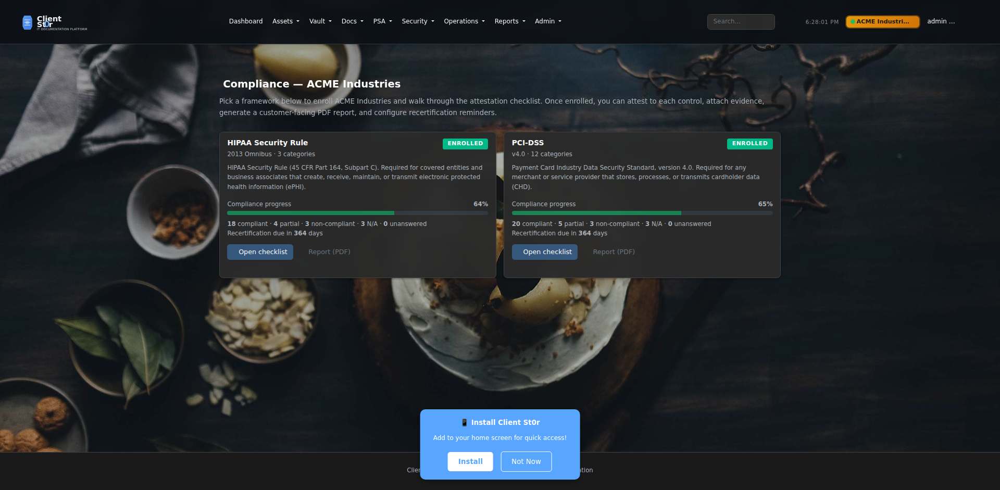
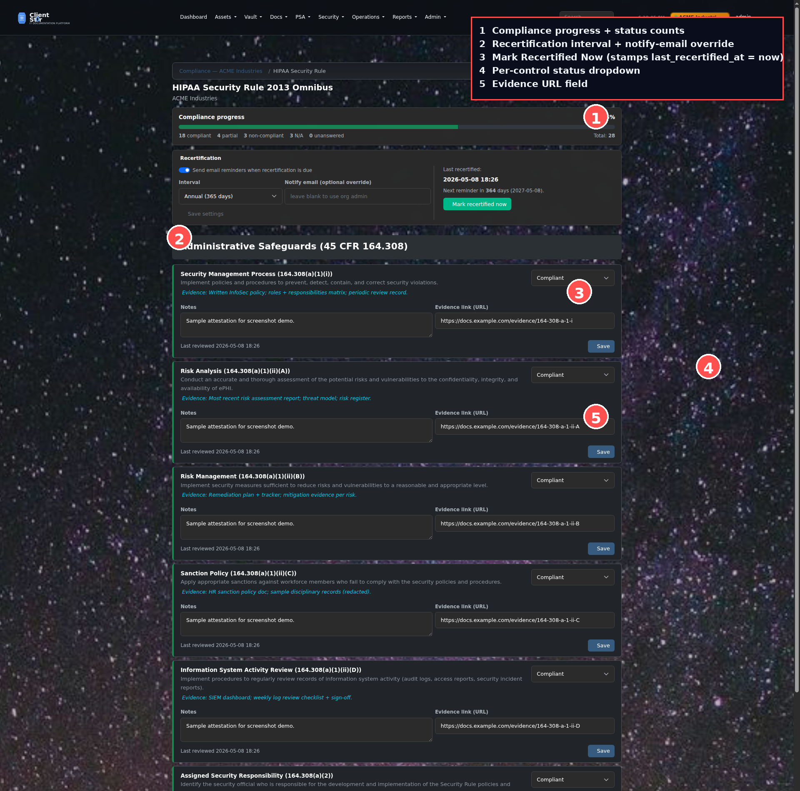

# Compliance Frameworks

Per-organization compliance attestation with seeded **PCI-DSS v4.0** and **HIPAA Security Rule** catalogs, branded customer-facing PDF reports, and monthly recertification reminders.

> **Available since v3.17.435 (Phase 41).** The catalogs are seeded once via `python manage.py seed_pci_dss` and `python manage.py seed_hipaa` — re-running the commands is safe (idempotent).

---

## Where to find it

`Compliance` lives under each organization's detail page:

| URL | What it shows |
|---|---|
| `/compliance/organizations/<id>/` | Per-framework cards with progress, status counts, recertification countdown |
| `/compliance/organizations/<id>/<framework-slug>/` | Attestation checklist for one framework |
| `/compliance/organizations/<id>/<framework-slug>/report.pdf` | Branded customer-facing PDF report |
| `/compliance/organizations/<id>/evidence-pack/` | Single ZIP audit bundle (Phase 39) |

**Who can see it:** superusers, staff, and members of the org with **Owner** or **Admin** role. Editor / Read-Only members are blocked.

---

## Step 1 — Enroll the org in a framework

Open the per-org compliance dashboard. Each available framework appears as a card.



Each card shows:

| Field | Meaning |
|---|---|
| **Progress bar** | `% compliant = compliant ÷ total attested` |
| **Status counts** | compliant / partial / non-compliant / N/A / unanswered |
| **Recertification due in N days** | derived from `last_recertified_at + recertification_interval_days` |
| **Open checklist** | jumps into per-control attestation |
| **Report (PDF)** | downloads the customer-facing PDF |

If the org isn't enrolled yet, click **Enroll in <framework>**. This creates the per-org enrollment record and unlocks the attestation flow.

---

## Step 2 — Attest each control

Open the checklist for an enrolled framework. Each control row is one row.



| # | Control |
|---|---|
| 1 | Compliance progress + status counts |
| 2 | Recertification interval + notify-email override |
| 3 | **Mark Recertified Now** — stamps `last_recertified_at = now` |
| 4 | Per-control status dropdown |
| 5 | Evidence URL field |

For each control, set:

| Status | Left border | Meaning |
|---|---|---|
| **Compliant** | green | Control is fully implemented and verified |
| **Partial** | orange | Control is partially in place; gaps remain |
| **Non-compliant** | red | Control is not implemented |
| **N/A** | grey | Control does not apply to this org |
| **Unanswered** | grey (default) | Not yet reviewed |

Add **notes** (free text) and an **evidence URL** (link to the supporting document, runbook, or artifact). Click **Save** on any row to persist; the row stamps `last_reviewed_at` and `last_reviewed_by` for audit history.

---

## Step 3 — Configure recertification reminders

The **Recertification** card at the top of the checklist controls reminder cadence:

| Field | Default | Notes |
|---|---|---|
| **Send email reminders** | ON | Toggle off to silence the cron for this enrollment |
| **Interval** | 365 days (annual) | Choose Monthly / Bi-monthly / Quarterly / Semi-annual / Annual |
| **Notify email override** | blank | If blank, falls back to org owner/admin Membership email, then `DEFAULT_FROM_EMAIL` |
| **Mark Recertified Now** | — | Stamps `last_recertified_at = now`; the next reminder fires `interval_days` from today |

Click **Save settings** to persist the toggle / interval / email override.

### How the cron runs

Reminders are sent by the `send_compliance_recertifications` management command, scheduled daily:

```bash
python manage.py send_compliance_recertifications        # send due reminders
python manage.py send_compliance_recertifications --dry-run   # preview only
```

**Idempotent + 7-day dedup:** the command writes a `RecertificationReminder` row each time it sends. If the cron fires twice for the same enrollment within 7 days, the second send is suppressed.

---

## Step 4 — Download the customer-facing report

From the org dashboard, click **Report (PDF)** on the enrolled framework's card. The PDF is rendered by the shared `reports.pdf_export.render_pdf` helper (Phase 19) and includes:

- Title + organization + framework version
- Summary card: percent compliant + status counts + recertification due
- Per-category sections, with each control row showing status, notes, evidence URL, and last-reviewed timestamp
- Generated-at timestamp footer

Hand this PDF to the customer as proof-of-attestation.

---

## Frameworks shipped

### PCI-DSS v4.0 *(38 controls across 12 categories)*

Real PCI-DSS v4.0 control numbers — `1.2.1`, `2.2.7`, `3.3.1`, `4.2.1`, `5.2.1`, `6.3.3`, `7.2.4`, `8.4.2`, `9.4.7`, `10.4.1`, `11.3.2`, `12.10.1`, …

### HIPAA Security Rule *(33 controls across 3 categories)*

45 CFR refs:
- **Administrative Safeguards** — `164.308`
- **Physical Safeguards** — `164.310`
- **Technical Safeguards** — `164.312`

Each control row carries the full subsection ref (e.g., `164.308(a)(1)(ii)(A)`).

---

## Data model (for developers)

| Model | Purpose |
|---|---|
| `ComplianceFramework` | Catalog (PCI-DSS, HIPAA, …). Seeded once. |
| `ComplianceCategory` | Per-framework grouping (e.g., "Build and Maintain a Secure Network"). |
| `ComplianceCheckItem` | Individual control. Has `slug`, `name`, `description`, `evidence_hint`. |
| `OrganizationCompliance` | Per-org enrollment with recertification settings. Computed: `recertification_due_at`, `days_until_recertification`, `status_counts()`, `percent_compliant()`. |
| `OrganizationComplianceItem` | Per-org-per-control attestation row (status / notes / evidence_link / last_reviewed_at / last_reviewed_by). |
| `RecertificationReminder` | Audit log of reminder emails. Used for 7-day dedup. |

---

## Related

- **[Phase 39 — Compliance Evidence Packs](../docs/ROADMAP.md)** — single-ZIP audit bundle for SOC2 / ISO27001 / due-diligence requests.
- **[Reports & Analytics](reports.md)** — the same `reports.pdf_export` helper renders branded PDFs for invoices, quotes, and compliance reports.
